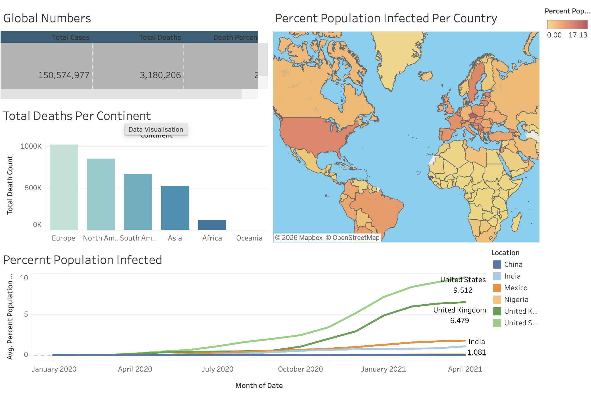

# COVID-19 SQL Analysis
This project performs an analysis of daily COVID-19 data from 2020 to 2021 across 200+ countries using SQLite. The analysis explores infection rates, death rates, and vaccination progress across different countries.

## Interactive Tableau Dashboard
Here is a preview of the interactive dashboard built from this analysis.

[](https://public.tableau.com/app/profile/opeoluwa.omoniyi6262/viz/CovidDashboardVisualisation_17830834849240/Dashboard1)
*> Click the preview image above to interact with the live dashboard on Tableau Public.*

## Dataset Description
The analysis uses two main datasets:
- **CovidDeaths1**: Contains COVID-19 case and death statistics by country and date
- **CovidVaccinations**: Contains COVID-19 vaccination data by country and date
Both datasets are sourced from [Our World in Data](https://ourworldindata.org/coronavirus) and were split into two tables for analysis purposes.

**Time Period**: January 2020 – December 2021

**Coverage**: 200+ countries, daily data

**Key Columns**: location, date, population, total_cases, total_deaths, new_vaccinations

## SQL Highlights 

### Calculating Rolling Vaccinations using Window Functions
```sql
SELECT 
    dea.continent, 
    dea.location, 
    dea.date, 
    dea.population, 
    vac.new_vaccinations,
    SUM(CAST(vac.new_vaccinations AS INT)) OVER (
        PARTITION BY dea.location 
        ORDER BY dea.location, dea.date
    ) AS rolling_people_vaccinated
FROM CovidDeaths dea
JOIN CovidVaccinations vac
    ON dea.location = vac.location 
    AND dea.date = vac.date
WHERE dea.continent IS NOT NULL;
```

## Analysis Questions
1. Total Cases vs Total Deaths: What is the death percentage for each country?
2. Infection Rate vs Population: What percentage of each country's population contracted COVID-19?
3. Highest Infection Rates: Which countries had the highest infection rates compared to their population?
4. Highest Death Counts: Which countries and continents had the highest death counts?
5. Global Numbers: What are the worldwide totals for cases, deaths, and death percentages?
6. Vaccination Progress: How are vaccination efforts progressing across different countries?

## Key Findings
### Infection & Death Analysis
- Global Death Percentage: ~1-2% of confirmed cases resulted in death
- Highest Death Count (Country): United States with over 1,000,000 deaths
- Highest Death Count (Continent): Europe had the highest total deaths
- Highest Infection Rate: Small countries (e.g., San Marino, Andorra) had highest infection rates
- UK Death Rate: Death percentage decreased over time as treatments improved.

### Vaccination Analysis
- Highest Vaccination Rate: Countries like Israel, UAE, and Portugal exceeded 90% vaccination coverage
- Vaccination Progress: Rolling vaccination counts show rapid acceleration in early 2021
- Wealthier countries: generally achieved higher vaccination rates
- Significant disparities: exist between developed and developing nations

### Key Insights
- Large population countries (US, India, Brazil) had highest absolute death counts
- Lockdown measures correlated with lower infection rates
- Death rates were highest during the initial pandemic waves
- Vaccination rates inversely correlated with death rates over time

## Key Queries
- Total Cases vs Total Deaths
- Infection Rate vs Population
- Vaccination Progress
- Global Numbers

## Tools Used
- SQLite
- DB Browser for SQLite
- Tableau Public

## How to Run
1. Open DB Browser for SQLite
2. Load the database file
3. Run the queries in `analysis.sql`
